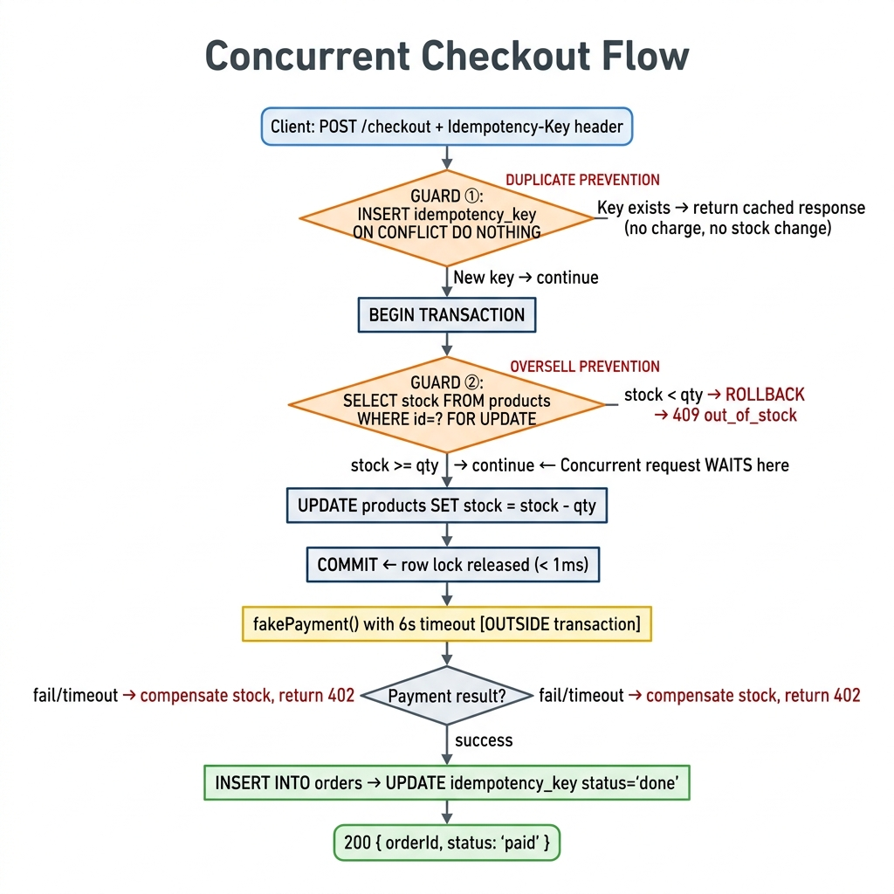
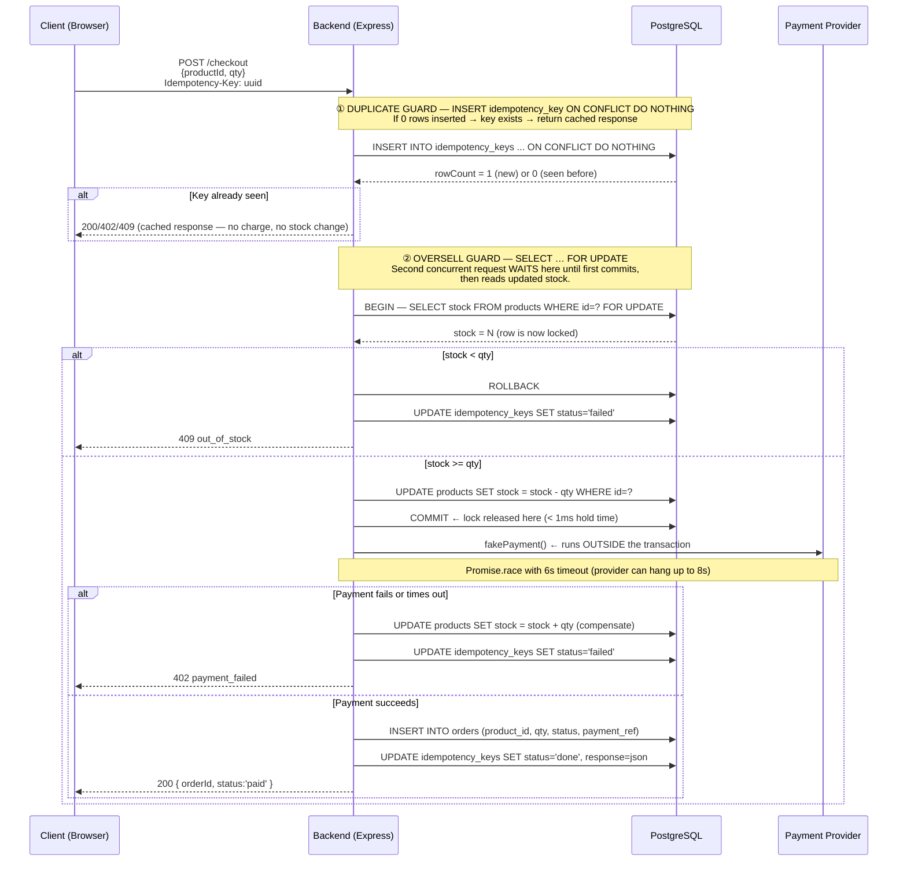

# DESIGN.md — Concurrent Checkout System

## 1. Flow Diagram

The diagram below traces the full journey from "user clicks Buy" to "order confirmed". The two orange diamonds are the critical safety guards — **① prevents duplicate orders** and **② prevents overselling**.





**Where overselling is prevented:** `SELECT … FOR UPDATE` at ②. The second concurrent request for the last unit is blocked at this line until the first transaction commits. It then reads the updated (zero) stock and returns 409.

**Where duplicate orders are prevented:** `INSERT … ON CONFLICT DO NOTHING` at ①. Every request must claim a unique idempotency key before any stock or payment logic runs.

---

## 2. Stock Approach — `SELECT … FOR UPDATE` (Pessimistic Lock)

### What I chose

A row-level pessimistic lock inside a short Postgres transaction:

```sql
BEGIN;
SELECT stock FROM products WHERE id = $1 FOR UPDATE;
-- application checks: if stock < qty → ROLLBACK
UPDATE products SET stock = stock - $qty WHERE id = $1;
COMMIT;
```

A `CHECK (stock >= 0)` constraint on the `products` table acts as a last line of defence — Postgres will reject any UPDATE that would take stock negative even if application logic has a bug.

### Why not the alternatives

| Approach | Reason rejected |
|----------|-----------------|
| **Redis counter** (`DECR`) | Adds infrastructure. Redis AOF/RDB persistence adds operational complexity. For a single-DB solution, unnecessary. |
| **Optimistic locking** (version column + retry loop) | Under high contention (50+ simultaneous requests for 5 units), causes a thundering herd of retries and wasted round-trips. Correct but painful. |
| **`UPDATE … WHERE stock >= qty`** without a lock | Atomic but gives no way to distinguish "product not found" from "out of stock" without a follow-up SELECT — two round-trips. Also harder to reason about. |

### One way `SELECT FOR UPDATE` could fail

**Connection pool exhaustion.** With 100,000 concurrent buy attempts, each waiting for a lock, the pg connection pool fills up. New requests fail to acquire a connection and receive a 500 before even touching the lock. Stock stays correct, but availability degrades.

**How to notice in production:** Alert on `pg_stat_activity` rows with `wait_event_type = 'Lock'` and `state = 'active'` for > 1s; alert on connection pool wait latency > 200ms (p95); alert on 500-error rate spike.

---

## 3. Retries & Duplicate Webhooks — Idempotency Keys

### The idempotency table

```sql
CREATE TABLE idempotency_keys (
  key          TEXT PRIMARY KEY,        -- Idempotency-Key header value
  request_hash TEXT NOT NULL,           -- SHA-256(productId:quantity)
  status       TEXT NOT NULL DEFAULT 'processing', -- processing | done | failed
  response     JSONB,                   -- cached { statusCode, body }
  created_at   TIMESTAMPTZ DEFAULT NOW()
);
```

### Step-by-step: user retries 5 times after a network error

1. **Attempt 1:** Client sends `POST /checkout` with `Idempotency-Key: abc-123`.
   - `INSERT … ON CONFLICT DO NOTHING` inserts 1 row (status = `processing`).
   - Stock is reserved, payment runs, order is created.
   - Row updated to `status = 'done'`, `response = { statusCode: 200, body: { orderId: 42 } }`.
2. **Attempts 2–5:** Network dropped before response arrived, client retries with the **same key**.
   - `INSERT … ON CONFLICT DO NOTHING` inserts 0 rows.
   - Fetch existing row → `status = 'done'` → return cached `{ orderId: 42 }` immediately.
   - **No stock touched. No payment charged. No second order.**

Result: exactly **one order** exists, regardless of how many retries.

### Step-by-step: payment webhook arrives twice

> **Implementation note:** This take-home uses a synchronous fake payment (`fakePayment()`) and does not implement a real webhook endpoint. Orders are created with `status = 'paid'` immediately after the fake payment resolves — there is no `'pending'` state. This matches the assignment's use of a fake provider.

**In production**, the payment provider sends `POST /webhook` asynchronously. The correct idempotent pattern is:

1. Order is created with `status = 'pending'` when checkout begins (before calling the real provider).
2. **First webhook:** `UPDATE orders SET status='paid' WHERE payment_ref='PAY-xyz' AND status='pending'` → affects **1 row**.
3. **Second webhook (duplicate):** same query → `status` is already `'paid'` → affects **0 rows**. No second update.

The guarded `WHERE status='pending'` clause makes the UPDATE naturally idempotent — it can run 100 times and the result is always the same single paid order. In addition, the provider's unique `paymentRef` can be stored with a `UNIQUE` constraint to reject duplicate inserts at the DB level.

### The checklist answers

| Question | Answer |
|----------|--------|
| Two people click Buy on the last unit at the same moment | One acquires the `FOR UPDATE` row lock and proceeds. The other **waits** at the lock, then reads `stock = 0` after the first commits, and gets 409 out_of_stock. |
| Payment provider never replies | `Promise.race([fakePayment(), timeout(6000)])` fires after 6 s. Stock is compensated back (`stock + qty`). Idempotency key set to `failed`. Reserved stock is **never stuck**. |
| Success webhook arrives twice | **Production answer:** `UPDATE orders SET status='paid' WHERE payment_ref=? AND status='pending'` — the second webhook finds `status` already `'paid'`, 0 rows change. **This implementation:** no real webhook — fake payment is synchronous, order written as `'paid'` directly. |
| User retries 5 times | All 5 hit the idempotency key check. Only the first (rowCount = 1) proceeds. The other 4 return the cached response. One order. |


---

## 4. Decisions

| # | Decision | Chosen | Rejected | Why |
|---|----------|--------|----------|-----|
| 1 | **Database** | PostgreSQL | SQLite, MongoDB | Row-level `FOR UPDATE` locking + ACID transactions. SQLite has coarser table-level write locking. Mongo requires compare-and-swap. |
| 2 | **Stock locking** | Pessimistic (`SELECT FOR UPDATE`) | Optimistic (version column + retry) | Under high contention (50+ requests for 5 units), optimistic locking creates a thundering herd of retries. Pessimistic is deterministic. |
| 3 | **Payment position in flow** | Outside DB transaction | Inside DB transaction | Holding `FOR UPDATE` during an 8-second payment call would block all concurrent checkouts for the same product for 8 s. Two-phase (commit stock first, then pay, compensate on failure) keeps lock hold time < 1 ms. |
| 4 | **Idempotency store** | Same Postgres DB | Redis, in-memory Map | No extra infrastructure. Atomic with order creation (both in same DB). Survives process restart. |
| 5 | **Payment timeout** | 6 seconds (`Promise.race`) | No timeout / 30 s | Assignment says provider "sometimes never replies". Without a timeout, reserved stock would stay locked indefinitely. 6 s gives headroom below the 8-s provider SLA while keeping UX responsive. |
| 6 | **Body-hash on idempotency key** | SHA-256(`productId:qty`) | Store full body | Same key with a different body must return 409. A hash is compact, deterministic, and avoids storing raw request payloads. |
